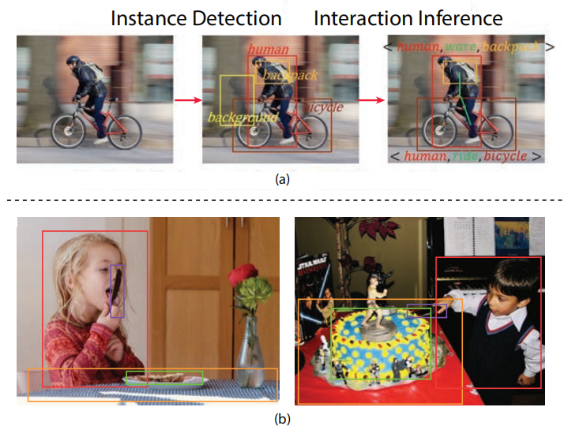
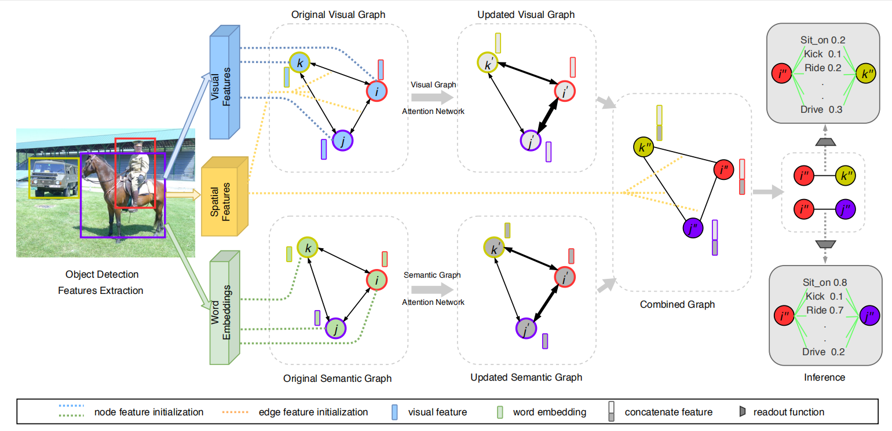

# Visual-Semantic Graph Attention Network for Human-Object Interaction Detecion

<!---------------------------------------------------------------------------------------------------------------->
## Preamble

A） Generally, HOI detection includes two steps: <b>Object detection</b> && <b>Interaction Inference</b>.

B） As for Interaction Inference, many previous works <b>mainly focused on features of the human as well as the directly interacted object</b>. 

C） Our insights: Not only the <b>primary relations</b> but also the <b>subsidiary relations</b> will provide significant cues to do intercation inference: <b>Contextual Information</b>.

- Consider the left image on Fig. b. If just focusing on the features of the girl and the directly interacted knife, it seems enough for the model to infer the action 'hold' but the subsidiary relations that the spatial relationship in (knife, cake) or (knife,desk) can make the model more certain that the 'cut' action has the low probabilty to happen. 
- Consider the right image on Fig.b. If the model ignores the contextual infromation while just focus on the primary object pair (boy,knife), it is hard for it to distinguish whether the action is 'stab' or 'cut'. However, if we let the model know there is cake here(semantic message) as well as the spatial relationship of subsidiary object pairs (cake, knife), it can help the model to infer the correct action.

    

<!---------------------------------------------------------------------------------------------------------------->
## VS-GATs

we study the disambiguating power of subsidiary scene relations via a <b>double Graph Attention Network</b> that aggregates <b>visual-spatial, and semantic information</b> in parallel. The network uses attention to leverage primary and subsidiary contextual cues to gain additional disambiguating power.


<b>Visual-Semantic Graph Attention Network</b>: After instance detection, a visual-spatial and a semantic graph are created. Node edge weights are dynamically through attention. We combine these graphs and then perform a readout step on box-pairs to infer all possible predicates between one subject and one object. 

<!---------------------------------------------------------------------------------------------------------------->
## Graph
### Preliminary
A graph $G$ is defined as $G=(V, E)$ that consists of a set of $V$ nodes and a set of $E$ edges. Node features and edge features are denoted by $\mathbf{h}_v$ and $\mathbf{h}_e$ respectively. Let $v_i \in V$  be the $ith$ node and $e_{i,j}=(v_i,v_j) \in E$ be the directed edge from $v_i$ to $v_j$.

A graph with $n$ nodes has a node features matrix $\mathbf{X}_v \in \mathbf{R}^{n \times d}$ and an edge feature matrix $ \mathbf{X}_e \in \mathbf{R}^{m \times c} $ where $\mathbf{h}_{v_i} \in \mathbf{R}^d$ is the feature vector of node $i$ and $\mathbf{h}_{e_{i,j}} \in \mathbf{R}^c $ is the feature vector of edge $(i,j)$. Fully connected edges imply $e_{i,j} \neq e_{j,i}$. 

### DGL
<a href='https://docs.dgl.ai/en/latest/install/index.html'>DGL</a> is a Python package dedicated to deep learning on graphs, built atop existing tensor DL frameworks (e.g. Pytorch, MXNet) and simplifying the implementation of graph-based neural networks.

<!---------------------------------------------------------------------------------------------------------------->
## Code Overview
In this project, we implement our method using the Pytorch and DGL library and there are three main folders: 

- `datasets/`: contains codes to prepare the train/test data;
- `model/`: contains codes to constructe the model;
- `result/`: contains codes to evalute the model;

In the following, we briefly introduce some main scripts.

#### datasets/
- `hico_process.sh`: the file that includes all comments to prepare for train/test data;
- `hico_constants.py` and `metadata.py`: configuration files;
- `hico_mat_to_json.py`: script to convert the original dataset `*.mat` files to `*.json` files;
- `hico_hoi_cls_count.py`: script to count the training samples of each HOI category;
- `hico_split_ids.py`: script to split the dataset into train/valuation/test dataset;
- `run_faster_rcnn.py`: script to run Faster R-CNN to save the object detection data;
- `select_confident_boxes.py`: script to select the confident detection boxes exceed the thresholds;
- `evaluate_instance_detection.py`: script to evalute the detection results(You can skim this script);
- `hico_train_val_test_data.py`: script to prepare the train/val/test data by matching the object detection result with ground-truth data;
- `hico_word2vec.py`: script to prepare the word embedding features;
- `spatial_feature.py`: script to prepare the spatial features;

#### model/
- `config.py`: configuration file;
- `model.py`: script to construct the whole model which include two main part: *graph networks* and *readout network*;
- `grnn.py`: script to construct the graph networks;
- `utils.py`: script to consturct the MLPs;

#### result/
- `hico_eval.sh`: the file that includes all comments to get the evaluation result;
- `compute_map.py`: script to calculate the map for each HOI category based on the HOI detection results;
- `sample_analysis.py`: script to calculate the mAP for *Full*, *Rare*, *Non-Rare*;

#### others
- `train.py`: script to train the model;
- `eval.py`: script to evalute the trained model;
- `utils/vis_tool.py`: script to visualize the detection results;

<!---------------------------------------------------------------------------------------------------------------->
## Getting Started

### Prerequisites
- Python 3.6
- Pytorch 1.1.0
- DGL 0.3
- CUDA 10.0
- Ubuntu 16.04

### Installation
1. Clone this repository.   

    ```
    git clone https://github.com/BIGJUN777/VS-GATs.git
    ```
  
2. Install Python dependencies:   

    ```
    pip install -r requirements.txt
    ```

### Prepare Data
#### Download original data
1. Download the original [HICO-DET](http://www-personal.umich.edu/~ywchao/hico/) dataset and put it into `datasets/hico`.
2. Download the pretrain word2vec model on [GoogleNews](https://code.google.com/archive/p/word2vec/) and put it into `datasets/word2vec` 

#### Process Data
1. You can directly download our processed data from [Here]()(**Uploading**) and put it into `datasets/`.
2. If you want to finish it by yourself, you first need to copy `utils/generalized_rcnn.py` and `roi_heads.py` these two files to the folder including the implemented Faster R-CNN(*e.g. `~/anaconda3/envs/py3_test/lib/python3.6/site-packages/torchvision/models/detection/`*) because we slightly modify the related code to save the desired visual features(We recommend you to backup the origial code first). And you can run the following commend:  

    ```
    bash datasets/hico_process.sh
    ```

### Training
There are several options we can set when training the model. See the `train.py` for more details. 

```
    python train.py --e_v='vs_gats_train' --t_m='epoch' --b_s=32 --f_t='fc7' --layers=1 --bn=False --lr=0.00001 --drop_prob=0.3  --m_a='false' --d_a='false' --bias='true' --optim='adam' --diff_edge='false' 
```
    
You can visualized the training process through tensorboard: `tensorboard --logdir='log'`
### Testing
We choose the checkpoint with low loss in valuation dataset(always about 250 epochs. You can use this [checkpoint]()(**Uploading**) to reproduce the detection result in our paper.).

```
bash result/hico_eval.sh 'final_ver' 'path_to_the_checkpoint_file'
```

### Acknowledgement
In this project, some codes which process the data and eval the model are built upon [ECCV2018-Learning Human-Object Interactions by Graph Parsing Neural Networks](https://github.com/SiyuanQi/gpnn) and [ICCV2019-No-Frills Human-Object Interaction Detection: Factorization, Layout Encodings, and Training Techniques](https://github.com/BigRedT/no_frills_hoi_det). Thanks them for their great works.
